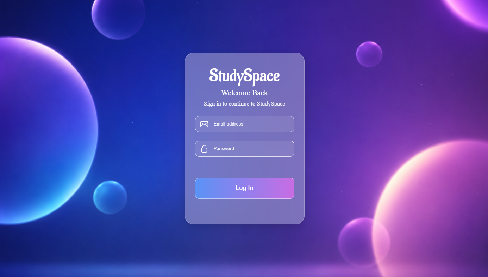
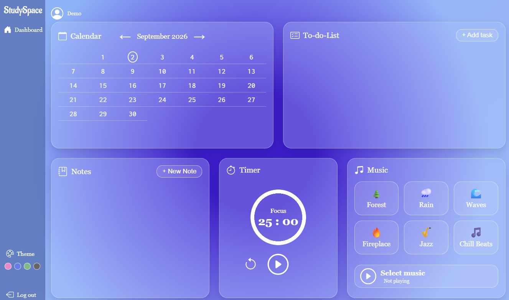
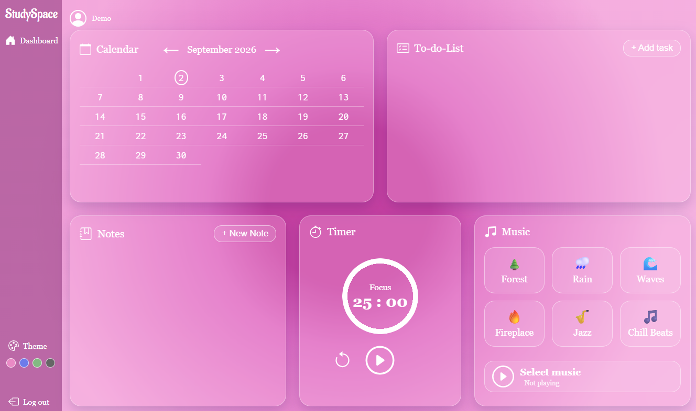
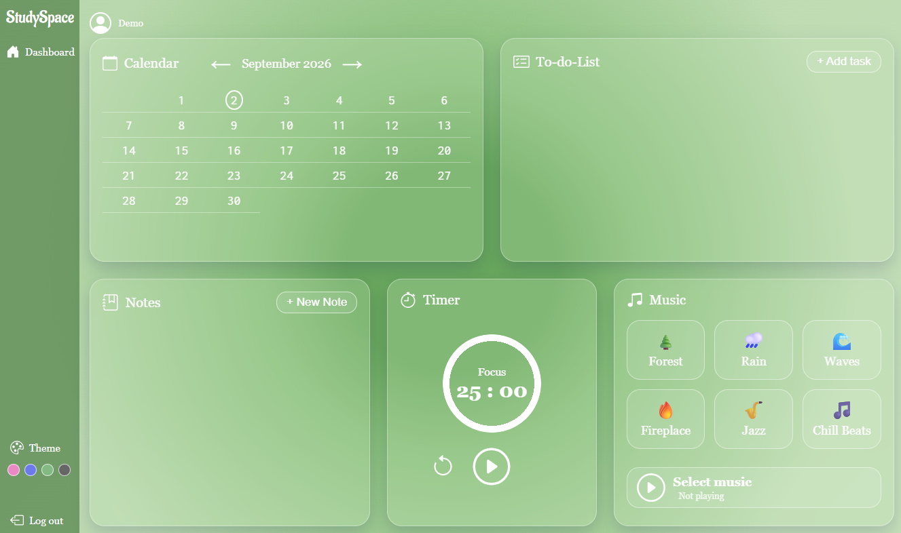
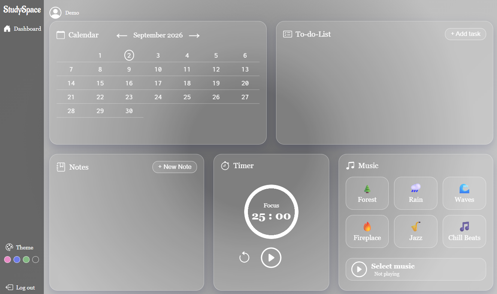

# StudySpace

StudySpace is a full-stack study productivity application built with **ASP.NET Core Razor Pages**, **SQL Server**, and **JavaScript**.

The application combines task management, notes, a Pomodoro timer, calendar navigation, background audio, 
and customizable themes in a single personal dashboard.

## Live Demo

[Open StudySpace](https://studyspace-despoina-bydpeehdbeahgsec.francecentral-01.azurewebsites.net)

### Demo Account

- **Email:** `test@test.com`
- **Password:** `StudySpace_Test_9284!`

## Preview

### Login


### Dashboard
 
 

## Features

### Productivity Tools
- **Task Management** - Add, complete, and delete tasks to organize your study priorities
- **Notes** - Create and delete study notes for quick reference
- **Pomodoro Timer** - Structured time management with 25-minute focus sessions and 5-minute breaks
- **Timer Notification** - Sound alerts when Pomodoro sessions end

### Study Environment
- **Background Music & Ambient Sounds** - Curated audio to enhance focus
- **Dynamic Calendar** - Navigate through previous and next months
- **Multiple Visual Themes** - Customize the interface to your preference

### Authentication & Data
- **Authentication** - User login with hashed password verification
- **Session Management** - Session-based access to the personal dashboard
- **Persistent Storage** - Tasks and notes stored in SQL Server
- **Personal Dashboards** - Tasks and notes are associated with each user's account

## Technologies

- **Backend:** C#, ASP.NET Core (.NET 10), Razor Pages
- **Database:** SQL Server, ADO.NET
- **Frontend:** HTML, CSS, JavaScript
- **Cloud:** Azure App Service, Azure SQL Database
- **Version Control:** Git, GitHub

## Architecture

The application follows a layered architecture:

```text
┌─────────────────────────────────┐
│     Razor Pages / PageModels    │
├─────────────────────────────────┤
│     Service Layer               │
│     DTOs / Models               │
├─────────────────────────────────┤
│     DAO Layer                   │
├─────────────────────────────────┤
│     SQL Server                  │
└─────────────────────────────────┘
```

## Project Structure

```text
StudySpaceApp/
├── Pages/                 # Razor Pages and page logic
│   ├── Login.cshtml
│   ├── Dashboard.cshtml
│   └── ...
├── Models/               # Domain models
│   ├── User.cs
│   ├── TodoTask.cs
│   └── Note.cs
├── DTO/                  # Data Transfer Objects
│   ├── UserLoginDTO.cs
│   ├── TodoTaskInsertDTO.cs
│   └── ...
├── Service/              # Business logic
│   ├── IUserService.cs
│   ├── UserServiceImpl.cs
│   └── ...
├── DAO/                  # Data Access Objects
│   ├── IUserDAO.cs
│   ├── UserDAOImpl.cs
│   └── ...
├── Helpers/              # Utility classes
│   └── DBHelper.cs
├── Database/             # Database scripts
│   └── StudySpaceDB.sql
└── wwwroot/              # CSS, images, audio, and other static assets
```

## Prerequisites

- Visual Studio 2022 or later (or Visual Studio Code with .NET SDK)
- .NET SDK 10.0 or later
- SQL Server or SQL Server Express
- SQL Server Management Studio (SSMS)
- Git

## Getting Started

### 1. Clone the Repository
```bash
git clone https://github.com/KrousaniotakiDespina/StudySpaceApp.git
cd StudySpaceApp
```

### 2. Set Up the Database
1. Open SQL Server Management Studio (SSMS).
2. Open `Database/StudySpaceDB.sql`.
3. Execute the script.
4. Confirm that the `StudySpaceDB` database and the `Users`, `TodoTasks`, and `Notes` tables have been created.

### 3. Configure Connection String
Configure the `DefaultConnection` using .NET User Secrets:
```bash
dotnet user-secrets init
dotnet user-secrets set "ConnectionStrings:DefaultConnection" "Server=YOUR_SERVER;Database=StudySpaceDB;User Id=YOUR_USER;Password=YOUR_PASSWORD;TrustServerCertificate=True;"
```

### 4. Build and Run
```bash
# Restore dependencies
dotnet restore

# Build the project
dotnet build

# Run the application
dotnet run
```

### 5. Access the Application
Open the local URL shown by ASP.NET Core in Visual Studio or the terminal.

To log in, use a valid user account that exists in the `Users` table.

## Usage

1. **Log In** - Enter your credentials to access your personal dashboard
2. **Manage Tasks** - Add new tasks, mark them as complete, or delete them
3. **Take Notes** - Create quick study notes for reference
4. **Use Pomodoro** - Start a Pomodoro session for focused work intervals
5. **Explore Calendar** - Navigate through previous and next months
6. **Customize Theme** - Select your preferred visual theme for a comfortable study environment
7. **Play Music** - Enable background music or ambient sounds to stay focused

## Database Schema

The database includes tables for:
- **Users** - User accounts and authentication
- **TodoTasks** - Todo items linked to users
- **Notes** - Study notes linked to users

Refer to `Database/StudySpaceDB.sql` for the complete schema.